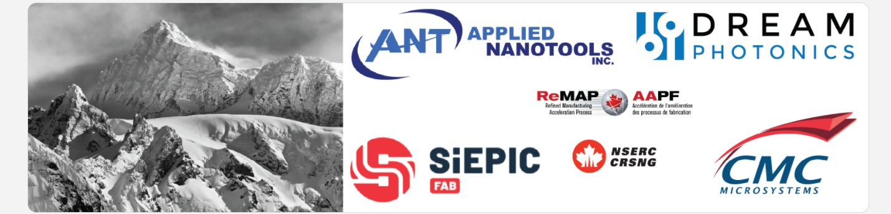
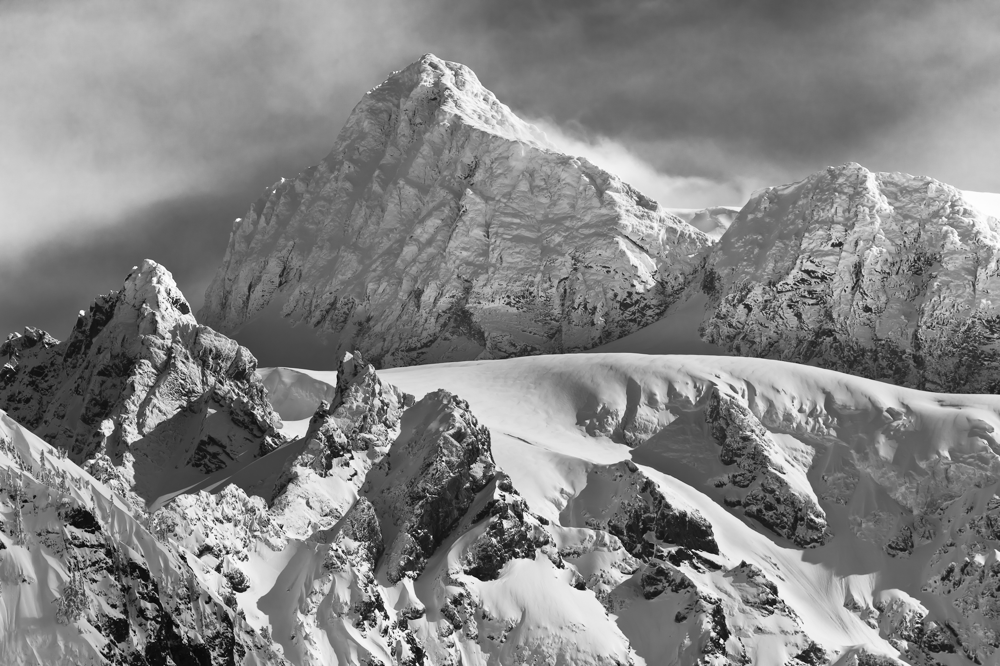

 

# SiEPICfab-Shuksan MPW fabrication run

* Documentation ([PDK](https://docs.google.com/document/d/1-JZsg_Nfs944Yq75YFgnUeDDumSKNufj8Ze5DLAEmiY/edit#))
* Installation instructions ([KLayout and Lumerical](https://docs.google.com/document/d/1-JZsg_Nfs944Yq75YFgnUeDDumSKNufj8Ze5DLAEmiY/edit#heading=h.7u3akpl3nqb0))
* Installation instructions ([Cadence and Lumerical](https://docs.google.com/document/d/1-JZsg_Nfs944Yq75YFgnUeDDumSKNufj8Ze5DLAEmiY/edit#heading=h.xf9wz2ialrvh)

The SiEPICfab / Applied Nanotools / Dream Photonics laser integration MPW run is named after <a href="https://en.wikipedia.org/wiki/Mount_Shuksan">Mount Shuksan</a> (2,783 m), Washington, USA / Nooksack territory, 19 km from Canada. “Shuksan”: Native American Nooksack word [Shéqsan], Lummi word [šéqsən], meanings steep and rugged, high up [Richardson, Galloway, “Nooksack Place Names”, 2011]

 
